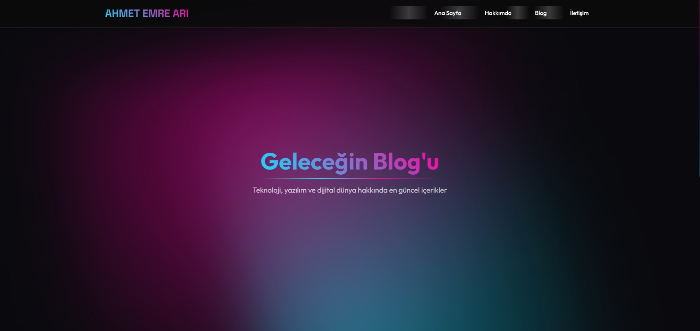
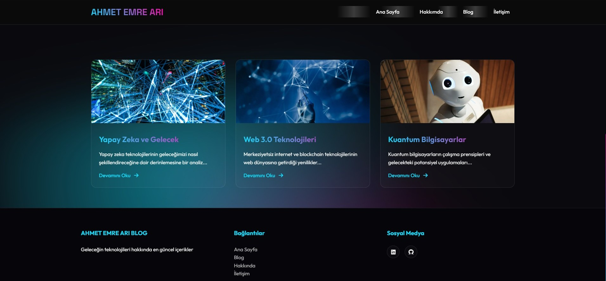
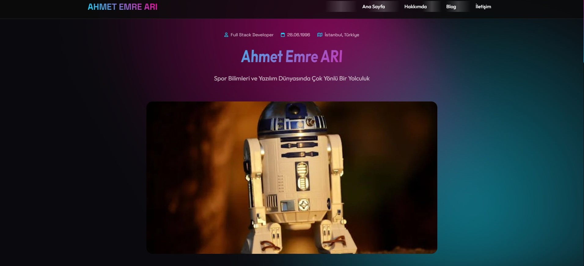
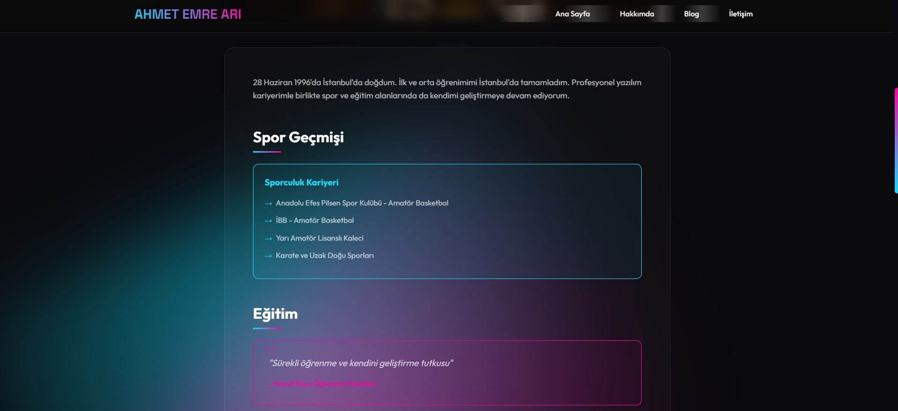
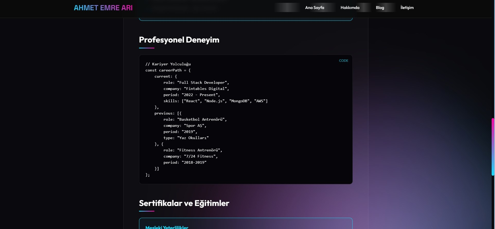
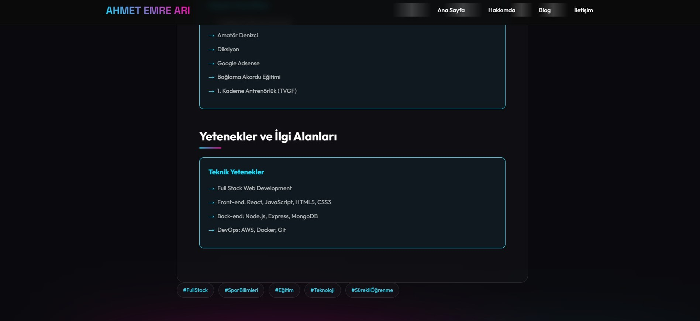
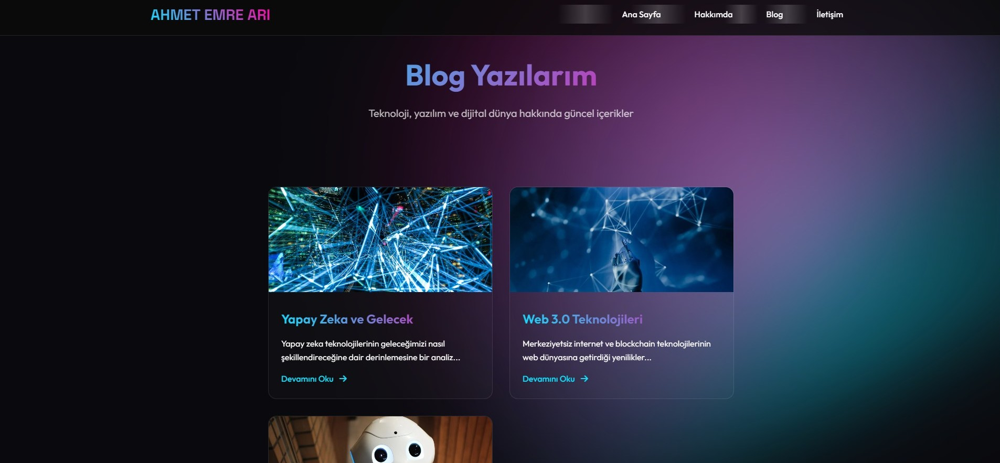
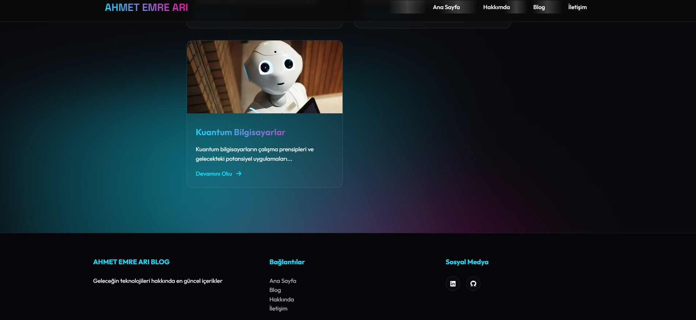
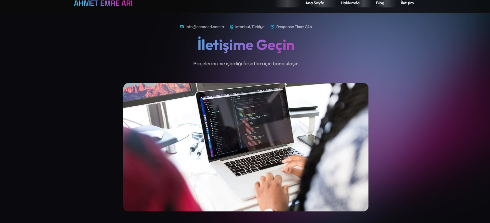
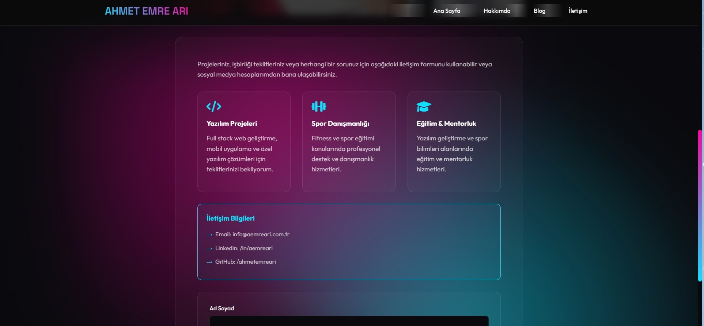

# Kişisel Blog Sitesi | Personal Blog Website
### Ekran Görüntüleri
#### Ana Sayfa



#### Hakkımda





#### Blog



#### İletişim


## 🇹🇷 Türkçe Açıklama

### Proje Hakkında
Bu proje, modern ve responsive bir kişisel blog sitesidir. Teknoloji, yazılım ve kişisel deneyimler hakkında içerik paylaşmak için tasarlanmıştır.

### Özellikler
- Responsive Tasarım
- Modern UI/UX
- Teknoloji Odaklı Blog Yazıları
- Kişisel Tanıtım Sayfası
- İletişim Formu

### Kullanılan Teknolojiler
- HTML5
- CSS3
- Responsive Design
- Font Awesome Icons
- Gradient Arka Planlar
- Scroll Animasyonları

### Sayfalar
- Ana Sayfa
- Hakkımda
- Blog
- Blog Yazıları
- İletişim

## 🇬🇧 English Description

### About the Project
This is a modern and responsive personal blog website designed to share content about technology, software, and personal experiences.

### Features
- Responsive Design
- Modern UI/UX
- Technology-Focused Blog Posts
- Personal Introduction Page
- Contact Form

### Technologies Used
- HTML5
- CSS3
- Responsive Design
- Font Awesome Icons
- Gradient Backgrounds
- Scroll Animations

### Pages
- Home Page
- About Me
- Blog
- Blog Posts
- Contact

### Setup
1. Clone the repository
2. Open `index.html` in your browser

### Contributing
1. Fork the repository
2. Create your feature branch
3. Commit your changes
4. Push to the branch
5. Create a new Pull Request
# Proje Klasör Yapısı

```
personal-blog/
│
├── index.html           # Ana sayfa
├── Hakkimda.html        # Hakkımda sayfası
├── blog.html            # Blog ana sayfası
├── Post1.html           # İlk blog yazısı
├── Post2.html           # İkinci blog yazısı
├── Post3.html           # Üçüncü blog yazısı
├── iletisim.html        # İletişim sayfası
│
├── style.css            # Ana stil dosyası
│
├── screenshots/         # Ekran görüntüleri
│   ├── Anasayfa1.jpg
│   ├── Anasayfa2.jpg
│   ├── Hakkimda1.jpg
│   ├── Hakkimda2.jpg
│   ├── Hakkimda3.jpg
│   ├── Hakkimda4.jpg
│   ├── Blog1.jpg
│   ├── Blog2.jpg
│   ├── Contact1.jpg
│   └── Contact2.jpg
│
├── README.md            # Proje açıklaması
│
└── LICENSE              # Lisans dosyası
```

## Dosya İşlevleri

- **HTML Dosyaları**: Her sayfa için ayrı HTML dosyası
- **style.css**: Tüm sayfaların stil dosyası
- **screenshots/**: Proje ekran görüntüleri
- **README.md**: Proje açıklaması ve bilgilendirme
- **LICENSE**: Açık kaynak lisans bilgisi

## Geliştirme Notları

- Responsive tasarım
- Modern UI/UX yaklaşımı
- Minimal ve temiz kod yapısı

### License
This project is open-source and available under the MIT License.

### Contact
- Email: info@aemreari.com.tr
- LinkedIn: [Ahmet Emre ARI](https://www.linkedin.com/in/aemreari/)
- GitHub: [ahmetemreari](https://github.com/ahmetemreari)
